# @blank-utils/load-balancer

> A type-safe, composable load balancer for Cloudflare Workers built with Effect-TS

[](https://www.npmjs.com/package/@blank-utils/load-balancer)
[](https://opensource.org/licenses/MIT)

## What is this?

This library lets you **build a load balancer at the edge** using Cloudflare Workers. Instead of paying for Cloudflare's enterprise load balancing, you can create your own with full control over:

- **Which backend servers receive traffic**
- **How traffic is routed** (round-robin, geo-based, health-based)
- **What happens when backends fail** (failover, recovery, logging)
- **Complete observability** via headers

```mermaid
flowchart TB
    subgraph Edge["☁️ Cloudflare Edge"]
        LB["🔀 Your Load Balancer Worker<br/>@blank-utils/load-balancer"]
    end
    
    User(("👤 User Request<br/>(anywhere in world)")) --> LB
    
    LB --> B1["🖥️ Backend 1<br/>(US-East)"]
    LB --> B2["🖥️ Backend 2<br/>(EU-West)"]
    LB --> B3["🖥️ Backend 3<br/>(AP-South)"]
    
    style Edge fill:#f9a825,stroke:#f57f17,color:#000
    style LB fill:#1976d2,stroke:#0d47a1,color:#fff
    style User fill:#43a047,stroke:#2e7d32,color:#fff
    style B1 fill:#7b1fa2,stroke:#4a148c,color:#fff
    style B2 fill:#7b1fa2,stroke:#4a148c,color:#fff
    style B3 fill:#7b1fa2,stroke:#4a148c,color:#fff
```



## Features

- 🎯 **Type-Safe Errors** — Every failure mode is explicit in the type signature
- 🌍 **Geo Steering** — Route by continent, country, region, or Cloudflare colo
- ⚡ **Multiple Failover Strategies** — `fail-forward`, `async-block`, `promise-any`
- 🔄 **Recovery Hook** — Handle total failures gracefully (logging, R2 dump, etc.)
- 📊 **Observability Headers** — Built-in `X-Load-Balancer-*` headers for debugging
- 🧩 **Composable** — Built on Effect services and layers for easy testing and extension
- ☁️ **Cloudflare Native** — Designed specifically for Cloudflare Workers runtime

## Installation

```bash
# pnpm (recommended)
pnpm add @blank-utils/load-balancer effect

# bun
bun add @blank-utils/load-balancer effect

# npm
npm install @blank-utils/load-balancer effect
```

---

## Examples

### 1. Basic Load Balancer

The simplest use case: distribute traffic across multiple backend servers.

```ts
import { Effect } from "effect"
import { LoadBalancer, endpoint } from "@blank-utils/load-balancer"

// Define your backend endpoints
const lb = LoadBalancer.live({
  endpoints: [
    endpoint("https://api1.example.com"),
    endpoint("https://api2.example.com"),
    endpoint("https://api3.example.com"),
  ],
})

export default {
  async fetch(request: Request): Promise<Response> {
    return Effect.gen(function* () {
      const loadBalancer = yield* LoadBalancer
      return yield* loadBalancer.handleRequest(request)
    }).pipe(
      Effect.provide(lb),
      Effect.runPromise
    )
  },
}
```

**What happens:**
1. Request comes to your Worker at the edge
2. Load balancer forwards request to first endpoint
3. If it fails (502, 503, 504, or network error), tries the next endpoint
4. Response is returned to user with added observability headers

---

### 2. Dynamic Route-Based Backend Selection

Route different paths to different backend services (API gateway pattern):


```ts
import { Effect } from "effect"
import { LoadBalancer, endpoint } from "@blank-utils/load-balancer"

// Different backend pools for different services
const authBackends = [
  endpoint("https://auth1.example.com"),
  endpoint("https://auth2.example.com"),
]

const apiBackends = [
  endpoint("https://api1.example.com"),
  endpoint("https://api2.example.com"),
  endpoint("https://api3.example.com"),
]

const staticBackends = [
  endpoint("https://cdn1.example.com"),
  endpoint("https://cdn2.example.com"),
]

// Create layers for each service
const authLB = LoadBalancer.live({ endpoints: authBackends })
const apiLB = LoadBalancer.live({ endpoints: apiBackends })
const staticLB = LoadBalancer.live({ endpoints: staticBackends })

export default {
  async fetch(request: Request): Promise<Response> {
    const url = new URL(request.url)
    
    // Route based on path prefix
    const program = Effect.gen(function* () {
      const lb = yield* LoadBalancer
      return yield* lb.handleRequest(request)
    })
    
    // Select the appropriate backend pool
    if (url.pathname.startsWith("/auth")) {
      return Effect.runPromise(program.pipe(Effect.provide(authLB)))
    }
    
    if (url.pathname.startsWith("/api")) {
      return Effect.runPromise(program.pipe(Effect.provide(apiLB)))
    }
    
    if (url.pathname.startsWith("/static") || url.pathname.startsWith("/assets")) {
      return Effect.runPromise(program.pipe(Effect.provide(staticLB)))
    }
    
    // Default to API backends
    return Effect.runPromise(program.pipe(Effect.provide(apiLB)))
  },
}
```

---

### 3. Geo-Based Routing

Route users to the nearest backend based on their geographic location:

```mermaid
flowchart TB
    subgraph World["🌍 Global Users"]
        NA((North America))
        EU((Europe))
        AS((Asia))
    end
    
    NA --> LB[Load Balancer]
    EU --> LB
    AS --> LB
    
    LB -->|NA/SA| US["🇺🇸 US Backend"]
    LB -->|EU/AF| Europe["🇪🇺 EU Backend"]
    LB -->|AS/OC| Asia["🌏 Asia Backend"]
    
    style US fill:#3f51b5,color:#fff
    style Europe fill:#009688,color:#fff
    style Asia fill:#ff5722,color:#fff
```



```ts
import { Effect } from "effect"
import { LoadBalancer, geoEndpoint, endpoint } from "@blank-utils/load-balancer"

const lb = LoadBalancer.live({
  geoEndpoints: [
    // North & South America → US servers
    geoEndpoint("https://us.api.example.com", {
      type: "continent",
      continents: ["NA", "SA"],
    }),
    
    // Europe & Africa → EU servers
    geoEndpoint("https://eu.api.example.com", {
      type: "continent",
      continents: ["EU", "AF"],
    }),
    
    // Asia & Oceania → Asia servers
    geoEndpoint("https://asia.api.example.com", {
      type: "continent",
      continents: ["AS", "OC"],
    }),
  ],
  
  steering: {
    type: "geo",
    // Fallback when no geo match (Antarctica, unknown locations)
    defaultEndpoints: [endpoint("https://us.api.example.com")],
  },
})

export default {
  async fetch(request: Request): Promise<Response> {
    return Effect.gen(function* () {
      const loadBalancer = yield* LoadBalancer
      // Cloudflare automatically adds `request.cf` with geo info
      return yield* loadBalancer.handleRequest(request)
    }).pipe(
      Effect.provide(lb),
      Effect.runPromise
    )
  },
}
```

**How Cloudflare geo data works:**

Cloudflare automatically attaches a `cf` object to every request with geo information:

```ts
request.cf = {
  continent: "NA",        // 2-letter continent code
  country: "US",          // 2-letter country code
  region: "California",   // Region/state name
  regionCode: "CA",       // Region code
  city: "San Francisco",
  colo: "SFO",           // Cloudflare datacenter code
  // ... more fields
}
```

---

### 4. Country-Specific Routing

Route traffic based on specific countries (useful for data residency compliance):

```ts
const lb = LoadBalancer.live({
  geoEndpoints: [
    // EU GDPR countries → EU datacenter
    geoEndpoint("https://eu.api.example.com", {
      type: "country",
      countries: ["DE", "FR", "IT", "ES", "NL", "BE", "AT", "PL", "SE", "FI"],
    }),
    
    // UK → UK datacenter (post-Brexit)
    geoEndpoint("https://uk.api.example.com", {
      type: "country",
      countries: ["GB"],
    }),
    
    // India → Mumbai datacenter
    geoEndpoint("https://in.api.example.com", {
      type: "country",
      countries: ["IN"],
    }),
    
    // US → US datacenter
    geoEndpoint("https://us.api.example.com", {
      type: "country",
      countries: ["US", "CA", "MX"],
    }),
  ],
  
  steering: {
    type: "geo",
    defaultEndpoints: [endpoint("https://us.api.example.com")],
  },
})
```

---

### 5. Region/State-Level Routing

Route within a country based on regions (for US states, Canadian provinces, etc.):

```ts
const lb = LoadBalancer.live({
  geoEndpoints: [
    // West Coast US → SFO datacenter
    geoEndpoint("https://us-west.api.example.com", {
      type: "region",
      regions: ["CA", "WA", "OR", "NV", "AZ"],
    }),
    
    // East Coast US → NYC datacenter
    geoEndpoint("https://us-east.api.example.com", {
      type: "region",
      regions: ["NY", "NJ", "PA", "MA", "CT", "FL", "GA"],
    }),
    
    // Central US → Chicago datacenter
    geoEndpoint("https://us-central.api.example.com", {
      type: "region",
      regions: ["IL", "TX", "OH", "MI", "IN"],
    }),
  ],
  
  steering: {
    type: "geo",
    defaultEndpoints: [endpoint("https://us-east.api.example.com")],
  },
})
```

---

### 6. Colo-Based Routing (Cloudflare Datacenter)

Route based on which Cloudflare datacenter is serving the request:

```ts
const lb = LoadBalancer.live({
  geoEndpoints: [
    // San Francisco, Los Angeles, Seattle colos → West backend
    geoEndpoint("https://us-west.backend.com", {
      type: "colo",
      colos: ["SFO", "LAX", "SEA", "PDX", "SAN"],
    }),
    
    // New York, Chicago, Miami colos → East backend
    geoEndpoint("https://us-east.backend.com", {
      type: "colo",
      colos: ["EWR", "ORD", "MIA", "IAD", "ATL"],
    }),
    
    // London, Frankfurt, Amsterdam → EU backend
    geoEndpoint("https://eu.backend.com", {
      type: "colo",
      colos: ["LHR", "FRA", "AMS", "CDG", "MAD"],
    }),
  ],
  
  steering: {
    type: "geo",
    defaultEndpoints: [endpoint("https://us-east.backend.com")],
  },
})
```

---

### 7. Health Checks with Custom Paths

Configure custom health check endpoints for each backend:

```ts
import { LoadBalancer, endpoint } from "@blank-utils/load-balancer"

const lb = LoadBalancer.live({
  endpoints: [
    endpoint("https://api1.example.com", {
      healthCheckPath: "/health",      // GET /health must return 2xx
      timeoutMs: 5000,                 // 5 second timeout
      weight: 1,                       // For future weighted routing
    }),
    
    endpoint("https://api2.example.com", {
      healthCheckPath: "/_internal/healthz",
      timeoutMs: 3000,
      weight: 2,
    }),
    
    endpoint("https://legacy-api.example.com", {
      healthCheckPath: "/ping",
      timeoutMs: 10000,  // Legacy server is slower
      weight: 1,
    }),
  ],
  
  // Use async-block to check health BEFORE forwarding
  availability: { type: "async-block" },
})
```

---

### 8. Failover with Custom Status Codes

Configure which HTTP status codes trigger failover:


```ts
const lb = LoadBalancer.live({
  endpoints: [
    endpoint("https://primary.api.example.com"),
    endpoint("https://secondary.api.example.com"),
    endpoint("https://tertiary.api.example.com"),
  ],
  
  availability: {
    type: "fail-forward",
    failoverOnStatuses: [
      500,  // Internal Server Error
      502,  // Bad Gateway
      503,  // Service Unavailable
      504,  // Gateway Timeout
      429,  // Too Many Requests (rate limited)
    ],
  },
})
```

---

### 9. Recovery Function (Graceful Degradation)

Handle total backend failure gracefully:

```ts
import { Effect } from "effect"
import { LoadBalancer, endpoint } from "@blank-utils/load-balancer"

const lb = LoadBalancer.live({
  endpoints: [
    endpoint("https://api1.example.com"),
    endpoint("https://api2.example.com"),
  ],
  
  recoveryFn: (request, context) =>
    Effect.gen(function* () {
      // Log the failure (to external service, R2, KV, etc.)
      console.error("All backends failed!", {
        url: request.url,
        method: request.method,
        triedEndpoints: context.triedEndpoints.map(ep => ep.url),
        lastError: context.lastError,
      })
      
      // Option 1: Return a fallback response
      return new Response(
        JSON.stringify({
          error: "Service temporarily unavailable",
          message: "We're experiencing issues. Please try again in a few minutes.",
          retryAfter: 30,
        }),
        {
          status: 503,
          headers: {
            "Content-Type": "application/json",
            "Retry-After": "30",
            "Cache-Control": "no-store",
          },
        }
      )
      
      // Option 2: Return undefined to propagate the error
      // return undefined
    }),
})
```

---

### 10. Racing Multiple Backends (Promise-Any)

Use the fastest healthy backend:

```ts
const lb = LoadBalancer.live({
  endpoints: [
    endpoint("https://api1.example.com", { healthCheckPath: "/health" }),
    endpoint("https://api2.example.com", { healthCheckPath: "/health" }),
    endpoint("https://api3.example.com", { healthCheckPath: "/health" }),
  ],
  
  // Race health checks in parallel, use first healthy one
  availability: { type: "promise-any" },
})
```

**How it works:**
1. Sends health check to ALL endpoints simultaneously
2. Uses the first endpoint that responds healthy
3. Fastest healthy backend wins!

---

### 11. API Versioning with Load Balancing

Route different API versions to different backend clusters:

```ts
export default {
  async fetch(request: Request): Promise<Response> {
    const url = new URL(request.url)
    const version = request.headers.get("X-API-Version") || "v1"
    
    // Different backend pools for different versions
    const v1Backends = LoadBalancer.live({
      endpoints: [
        endpoint("https://v1.api.example.com"),
        endpoint("https://v1-backup.api.example.com"),
      ],
    })
    
    const v2Backends = LoadBalancer.live({
      endpoints: [
        endpoint("https://v2.api.example.com"),
        endpoint("https://v2-backup.api.example.com"),
      ],
    })
    
    const program = Effect.gen(function* () {
      const lb = yield* LoadBalancer
      return yield* lb.handleRequest(request)
    })
    
    // Route based on version header
    const layer = version === "v2" ? v2Backends : v1Backends
    
    return Effect.runPromise(program.pipe(Effect.provide(layer)))
  },
}
```

---

### 12. Blue-Green Deployment

Gradually shift traffic between deployments:

```ts
const blueEndpoints = [
  endpoint("https://blue.api.example.com"),
  endpoint("https://blue-2.api.example.com"),
]

const greenEndpoints = [
  endpoint("https://green.api.example.com"),
  endpoint("https://green-2.api.example.com"),
]

// Control percentage via environment variable or KV
const TRAFFIC_SPLIT = 0.2  // 20% to green

export default {
  async fetch(request: Request): Promise<Response> {
    // Simple traffic split
    const useGreen = Math.random() < TRAFFIC_SPLIT
    
    const layer = LoadBalancer.live({
      endpoints: useGreen ? greenEndpoints : blueEndpoints,
    })
    
    return Effect.gen(function* () {
      const lb = yield* LoadBalancer
      return yield* lb.handleRequest(request)
    }).pipe(
      Effect.provide(layer),
      Effect.runPromise
    )
  },
}
```

---

### 13. Canary Deployments with Sticky Sessions

Route specific users to canary backend:

```ts
export default {
  async fetch(request: Request): Promise<Response> {
    // Check for canary cookie or header
    const isCanaryUser = 
      request.headers.get("X-Canary") === "true" ||
      request.headers.get("Cookie")?.includes("canary=true")
    
    const layer = isCanaryUser
      ? LoadBalancer.live({
          endpoints: [
            endpoint("https://canary.api.example.com"),
          ],
        })
      : LoadBalancer.live({
          endpoints: [
            endpoint("https://stable1.api.example.com"),
            endpoint("https://stable2.api.example.com"),
          ],
        })
    
    return Effect.gen(function* () {
      const lb = yield* LoadBalancer
      return yield* lb.handleRequest(request)
    }).pipe(
      Effect.provide(layer),
      Effect.runPromise
    )
  },
}
```

---

### 14. Full Featured Example

Combining multiple features:

```ts
import { Effect } from "effect"
import { LoadBalancer, endpoint, geoEndpoint } from "@blank-utils/load-balancer"

// Production-grade load balancer configuration
const lb = LoadBalancer.live({
  // Regular endpoints (used as fallback)
  endpoints: [
    endpoint("https://us.api.example.com", { 
      healthCheckPath: "/health",
      timeoutMs: 5000,
    }),
    endpoint("https://eu.api.example.com", { 
      healthCheckPath: "/health",
      timeoutMs: 5000,
    }),
  ],
  
  // Geo-aware routing
  geoEndpoints: [
    geoEndpoint("https://us.api.example.com", 
      { type: "continent", continents: ["NA", "SA"] },
      { healthCheckPath: "/health" }
    ),
    geoEndpoint("https://eu.api.example.com",
      { type: "continent", continents: ["EU", "AF"] },
      { healthCheckPath: "/health" }
    ),
    geoEndpoint("https://asia.api.example.com",
      { type: "continent", continents: ["AS", "OC"] },
      { healthCheckPath: "/health" }
    ),
  ],
  
  // Geo steering configuration
  steering: {
    type: "geo",
    defaultEndpoints: [endpoint("https://us.api.example.com")],
  },
  
  // Failover configuration
  availability: {
    type: "fail-forward",
    failoverOnStatuses: [500, 502, 503, 504, 429],
  },
  
  // Recovery: what to do when ALL backends fail
  recoveryFn: (_request, context) =>
    Effect.succeed(
      new Response(
        JSON.stringify({
          error: "Service Unavailable",
          tried: context.triedEndpoints.length,
          message: "All backend servers are currently unavailable",
        }),
        {
          status: 503,
          headers: {
            "Content-Type": "application/json",
            "Retry-After": "60",
          },
        }
      )
    ),
})

export default {
  async fetch(request: Request): Promise<Response> {
    return Effect.gen(function* () {
      const loadBalancer = yield* LoadBalancer
      return yield* loadBalancer.handleRequest(request)
    }).pipe(
      Effect.provide(lb),
      Effect.runPromise
    )
  },
}
```

---

## Availability Methods

| Method | Description | Use Case |
|--------|-------------|----------|
| `fail-forward` | Tries endpoints in order, fails over on error | Default. Best for most use cases |
| `async-block` | Sequential health check before forwarding | When you need to verify health first |
| `promise-any` | Race health checks, use fastest | When latency matters most |

---

## Response Headers

The load balancer adds observability headers to every response:

| Header | Description |
|--------|-------------|
| `X-Load-Balancer-Endpoint` | The endpoint URL that served the request |
| `X-Load-Balancer-Latency` | Total request latency in milliseconds |
| `X-Load-Balancer-Endpoint-Gather-Latency` | Time to select the endpoint |
| `X-Load-Balancer-Tried-Count` | Number of endpoints tried (on failover) |
| `X-Load-Balancer-Tried-Endpoints` | Comma-separated list of tried endpoints |

---

## Error Types

All errors are typed for explicit handling:

```ts
import { Effect } from "effect"
import {
  NoHealthyEndpointsError,
  EndpointUnhealthyError,
  RequestForwardError,
} from "@blank-utils/load-balancer"

const program = Effect.gen(function* () {
  const lb = yield* LoadBalancer
  return yield* lb.handleRequest(request)
}).pipe(
  // Handle specific error types
  Effect.catchTag("NoHealthyEndpointsError", (error) => {
    console.log("All endpoints failed:", error.triedEndpoints)
    return Effect.succeed(new Response("No healthy endpoints", { status: 503 }))
  }),
  
  Effect.catchTag("RequestForwardError", (error) => {
    console.log("Forward failed to:", error.endpoint.url)
    return Effect.succeed(new Response("Backend error", { status: 502 }))
  })
)
```

---

## API Reference

### Exports

```ts
// Data Types
export { Endpoint, endpoint } from "@blank-utils/load-balancer"
export { GeoEndpoint, geoEndpoint } from "@blank-utils/load-balancer"

// Services
export { LoadBalancer } from "@blank-utils/load-balancer"
export { HealthChecker, HealthCheckerLive, HealthCheckerTest } from "@blank-utils/load-balancer"

// Errors
export {
  NoHealthyEndpointsError,
  EndpointUnhealthyError,
  CircuitOpenError,
  RequestForwardError,
} from "@blank-utils/load-balancer"

// Availability Methods
export {
  failForward,
  asyncBlock,
  promiseAny,
  DEFAULT_FAILOVER_STATUSES,
} from "@blank-utils/load-balancer"

// Utilities
export { selectGeoEndpoints } from "@blank-utils/load-balancer"
export { withRecovery } from "@blank-utils/load-balancer"
export { addLoadBalancerHeaders, HEADERS } from "@blank-utils/load-balancer"
export { forwardRequest } from "@blank-utils/load-balancer"
```

---

## Roadmap

- [ ] Circuit breaker pattern with pluggable state store (KV, Durable Objects)
- [ ] Weighted load balancing
- [ ] Response time steering (route to fastest responding backend)
- [ ] OpenTelemetry integration
- [ ] Rate limiting per endpoint

---

## Requirements

- **Runtime**: Cloudflare Workers
- **Dependencies**: `effect` ^3.0.0

## License

MIT © blank

---

Built with ❤️ using [Effect-TS](https://effect.website)
