# Examples

This directory contains ready-to-use Cloudflare Worker examples demonstrating various load balancer patterns.

## Quick Start

Each example can be deployed as a Cloudflare Worker. Copy the example to your project and customize the endpoints.

```bash
# Create a new worker project
mkdir my-load-balancer && cd my-load-balancer
pnpm init
pnpm add @blank-utils/load-balancer effect

# Copy an example
cp examples/workers/basic.ts src/index.ts

# Deploy with Wrangler
npx wrangler deploy
```

## Examples Overview

### [basic.ts](./workers/basic.ts)
Simple load balancer with 3 backend servers and automatic failover.


### [api-gateway.ts](./workers/api-gateway.ts)
Route different paths to different backend services (microservices pattern).


### [geo-steering.ts](./workers/geo-steering.ts)
Route users to the nearest backend based on geographic location.

```mermaid
flowchart TB
    User((User)) --> Edge[Cloudflare Edge]
    Edge --> LB[Load Balancer]
    
    LB -->|NA/SA| US[🇺🇸 US Backend]
    LB -->|EU/AF| EU[🇪🇺 EU Backend]
    LB -->|AS/OC| Asia[🌏 Asia Backend]
    
    style US fill:#3f51b5
    style EU fill:#009688
    style Asia fill:#ff5722
```



### [blue-green.ts](./workers/blue-green.ts)
Gradually shift traffic between two deployment environments.


### [canary.ts](./workers/canary.ts)
Route specific users (beta testers, internal team) to canary backend.


### [data-residency.ts](./workers/data-residency.ts)
Route traffic based on country for GDPR/data residency compliance.

```mermaid
flowchart TB
    User((User)) --> LB[Load Balancer]
    
    LB -->|🇩🇪🇫🇷🇮🇹...| EU[EU Datacenter<br/>Frankfurt]
    LB -->|🇬🇧| UK[UK Datacenter<br/>London]
    LB -->|🇮🇳| India[India Datacenter<br/>Mumbai]
    LB -->|🇺🇸🇨🇦🇲🇽| US[US Datacenter<br/>Virginia]
    
    style EU fill:#3f51b5
    style UK fill:#9c27b0
    style India fill:#ff9800
    style US fill:#4caf50
```



### [api-versioning.ts](./workers/api-versioning.ts)
Route different API versions to different backend clusters.


### [recovery-handler.ts](./workers/recovery-handler.ts)
Handle total backend failures gracefully with logging, alerting, and fallback responses.

```mermaid
flowchart TB
    User((User)) --> LB[Load Balancer]
    LB -->|Try| B1[Backend 1] -.-> |❌ Failed| LB
    LB -->|Failover| B2[Backend 2] -.-> |❌ Failed| LB
    
    LB --> Recovery[Recovery Function]
    Recovery --> Log[📋 Console Log]
    Recovery --> R2[💾 Store in R2]
    Recovery --> Webhook[🔔 Alert Webhook]
    Recovery --> Response[📤 503 Response]
    
    style B1 fill:#f44336
    style B2 fill:#f44336
    style Recovery fill:#ff9800
```



## Integration Testing

See the [integration/](./integration/) directory for testing the load balancer locally with Wrangler dev server.
